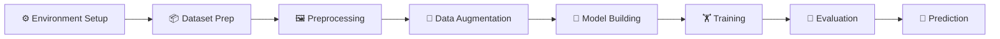

<div align="center">

# 🐶📸 Dog Breed Classifier
### *"Is that a Labrador or just a very confident golden retriever?" — solved with Transfer Learning*

[](https://www.python.org/)
[](https://www.tensorflow.org/)
[](https://keras.io/)
[](https://colab.research.google.com/)
[](https://jupyter.org/)

[](#-license)
[](#)
[](#)


*One pretrained Xception model, a hundred fluffy faces, zero training from scratch.* 🦴

</div>

---

## 📖 What's This All About?

Ever squinted at a dog and thought *"okay but WHICH kind of good boy is this?"* — this project answers that, using **Transfer Learning** with the **Xception** architecture (pretrained on ImageNet) instead of building a CNN from zero.

Less training time, less compute, more tail-wagging accuracy. 🐕‍🦺

<details>
<summary><strong>🔍 Peek inside the notebook</strong></summary>

- 📦 Dataset preparation (Kaggle Dog Breed Identification)
- 🖼️ Image preprocessing & resizing to 299×299×3
- 🎨 Data augmentation (rotation, flip, zoom, shift, shear)
- 🧠 Transfer Learning with pretrained Xception
- 🏋️ Fine-tuning with custom classification head
- 📏 Evaluation (Accuracy, Precision, Recall, F1, Confusion Matrix)
- 🔮 Predictions on brand-new images (even from a URL!)

</details>

**Goal:** Recognize dog breeds from images accurately, efficiently, and without needing a GPU farm.

---

## 🎯 Objectives

- 🐾 Build an image classifier for dog breed recognition
- 🧠 Apply Transfer Learning using the Xception architecture
- 🎨 Use preprocessing & augmentation to boost generalization
- 🔧 Fine-tune a pretrained model for higher accuracy
- 📏 Evaluate with proper classification metrics
- 🔗 Predict breeds straight from image URLs

---

## 📂 Dataset

<div align="center">

| 📦 Source | Kaggle — Dog Breed Identification |
|:--|:--|
| 🏷️ Contains | Training images, breed labels, test images |
| ⚡ Optimized for | CPU-friendly training on **Top 10–20** most frequent breeds |

</div>

> Training on a curated subset keeps things fast without sacrificing the "wow, it actually works" factor.

---

## 🧠 The Architecture — Why Xception?

Instead of reinventing the wheel (or in this case, the convolution), this project stands on the shoulders of a giant: **Xception**, pretrained on ImageNet.

<div align="center">

| 🚀 Benefit | Why It Matters |
|:--|:--|
| ⚡ Faster convergence | Less time waiting, more time tweaking |
| 🎯 Better feature extraction | Already knows edges, textures, shapes |
| 📈 Higher accuracy | Standing on ImageNet's shoulders |
| ⏱️ Reduced training time | No CPU meltdown required |
| 🧩 Improved generalization | Works well even on unseen breeds |

</div>

**Custom head added on top:**
```
Xception (frozen base)
      ↓
Global Average Pooling
      ↓
Batch Normalization
      ↓
Dense Layer
      ↓
Dropout
      ↓
Softmax Classifier 🐶
```

---

## 🔄 Project Workflow



<details>
<summary><strong>📋 Step-by-step breakdown</strong></summary>

**1. Environment Setup**
Mount Google Drive → Install dependencies → Import libraries.

**2. Dataset Preparation**
Load dataset → Read labels → Select top breeds → Train/validation split.

**3. Data Preprocessing**
Resize to `299×299×3` → Normalize pixels → Decode images → Batch prep.

**4. Data Augmentation**
Random Rotation · Horizontal Flip · Zoom · Width/Height Shift · Shear — all to make the model less of a one-trick pony.

**5. Model Building**
Pretrained Xception (no top) + Global Average Pooling + Batch Norm + Dense + Dropout + Softmax. Compiled with Adam.

**6. Model Training**
Mini-batch learning → Per-epoch validation → Loss minimization → Accuracy tracking.

**7. Model Evaluation**
Validation Accuracy · Validation Loss · Precision · Recall · F1 · Confusion Matrix.

**8. Prediction**
Feed in a new image (or even just a URL) → Preprocess → Infer → Reveal the breed. 🎉

</details>

---

## 🛠️ Tech Stack

<div align="center">

| Category | Tools |
|:--|:--|
| **Core** |    |
| **Deep Learning** |   |
| **Data & Utils** |    |
| **Visualization** |  |

</div>

---

## 📊 Visualizations

| Type | What It Shows |
|:--|:--|
| 🖼️ Sample Training Images | A peek at the doggo dataset |
| 🎨 Augmentation Examples | Before/after of the image tweaks |
| 📈 Training Accuracy Curve | Is it actually learning? |
| 📉 Loss Curves | Watching the loss go down (hopefully) |
| 🧩 Confusion Matrix | Which breeds get mixed up the most |
| 🔮 Prediction Results | Model's final verdict on new images |

---

## 📁 Project Structure

```
Dog-Breed-Classification/
│
├── dog_breed_classification.ipynb   # The main notebook
├── train/                            # Training images
├── labels.csv                        # Breed labels
├── README.md                         # You are here 👋
└── requirements.txt                  # Dependencies
```

---

## ⚙️ Quick Start

### 1️⃣ Clone it
```bash
git clone https://github.com/SiriNandinii/Dog-Breed-Classification.git
cd Dog-Breed-Classification
```

### 2️⃣ Install the goodies
```bash
pip install tensorflow keras numpy pandas matplotlib scikit-learn tqdm
```

### 3️⃣ Fire up Jupyter
```bash
jupyter notebook
```

### 4️⃣ Open & run
```
dog_breed_classification.ipynb  →  Run All Cells ▶️
```

> 🐾 Pro tip: this one's friendly enough to run on CPU — no need to beg a GPU for mercy.

---

## 📈 Model Performance

<div align="center">

| Metric Type | Metrics |
|:--|:--|
| 🎯 Classification | Accuracy · Precision · Recall · F1 Score |
| 📊 Visualization | Confusion Matrix · Training/Validation Curves |

</div>

The pretrained Xception backbone achieves **high validation accuracy** with **significantly less training time** than a CNN trained from scratch. Efficiency *and* good boys — best of both worlds. 🐕

---

## 🌟 Highlights Reel

<div align="center">

| ✅ | Highlight |
|:--:|:--|
| 🔄 | End-to-end image classification pipeline |
| 🧠 | Transfer Learning with Xception |
| 🎨 | Data augmentation for better generalization |
| ⚡ | Efficient training on limited compute |
| 🎯 | High accuracy on a real-world dataset |
| 🧩 | Confusion matrix analysis |
| 🔮 | Predictions on custom, unseen images |
| 🧼 | Clean, modular notebook |

</div>

---

## 🎯 What You'll Walk Away With

- 👁️ Computer Vision fundamentals
- 🖼️ Image classification techniques
- 🧠 Transfer Learning principles
- 🏗️ The Xception architecture
- 🎨 Image preprocessing & augmentation
- 🔧 Fine-tuning pretrained models
- 📏 Performance evaluation for classifiers
- 🚀 Deep learning deployment concepts

---

## 🔮 Future Improvements

- [ ] EfficientNet
- [ ] ResNet50
- [ ] MobileNetV3
- [ ] Vision Transformers (ViT)
- [ ] Ensemble Learning
- [ ] Grad-CAM Explainability
- [ ] Streamlit Web App
- [ ] Flask REST API Deployment
- [ ] Docker Containerization
- [ ] ONNX Model Export
- [ ] TensorFlow Lite Mobile Deployment

---

## 💡 Real-World Applications

<div align="center">

| 🐾 | Application |
|:--:|:--|
| 🏠 | Pet identification systems |
| 🏥 | Veterinary AI tools |
| 🌳 | Wildlife classification |
| 📹 | Animal monitoring |
| 📷 | Automated image recognition |
| 🔒 | Smart camera systems |

</div>

---

## 👩‍💻 Author

<div align="center">

**Siri Nandini Alanka**

*AI & Machine Learning Student | Deep Learning Enthusiast | Full Stack Developer*

[](https://github.com/SiriNandinii)

</div>

---

## 📄 License


This project is intended for **educational, research, and learning purposes**. Feel free to use, modify, and extend the implementation with proper attribution. 🙏

---

## 🙌 Acknowledgements

Big thanks to:

<div align="center">


</div>

for the dataset, pretrained models, tools, and compute that made this project possible.

---

<div align="center">

### ⭐ If your model correctly identified a dog, this repo deserves a star.

*Built with Transfer Learning and an unreasonable fondness for dogs.* 🐶💛

</div>
